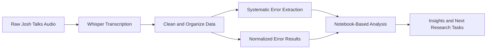

# Josh Talks Whisper Error Analysis

## Overview
This project studies transcription quality on Josh Talks audio using Whisper outputs.
The goal is to understand how and why transcription errors happen, then build a stronger evaluation pipeline for continuous quality improvement.

### Workspace Snapshot
| Component | Description | Current Stage |
|---|---|---|
| Notebook analysis | Exploratory and comparative analysis workflow |  |
| Clean dataset | Preprocessed Whisper data for evaluation |  |
| Systematic error file | Structured error output for targeted review |  |
| Normalized error file | Normalized error set for cleaner comparison |  |
| Expanded research tasks | Deeper analysis and additional evaluation layers |  |

## Problem
Automatic Speech Recognition (ASR) systems can introduce errors due to accents, speaking styles, background noise, named entities, and contextual vocabulary.
These issues reduce trust in transcripts and can impact downstream use cases.

This project focuses on measuring those errors systematically so we can improve transcription quality in a data-driven way.

## Workflow

## What We Have Done
1. Collected and organized project datasets.
2. Prepared clean Whisper-related data for evaluation.
3. Generated systematic error outputs.
4. Generated normalized error outputs.
5. Built a notebook workflow for exploratory analysis.

## What We Achieved
| Outcome | Impact |
|---|---|
| Reproducible analysis setup | Results can be repeated and extended consistently |
| Baseline error datasets | Enables before-vs-after comparison over future iterations |
| Early error pattern visibility | Supports targeted improvement planning |

## Research Progress

| Track | Status |
|---|---|
| Baseline setup |  |
| Error categorization depth |  |
| Expanded sample coverage |  |
| Evaluation refinement |  |

## Current Status
Research is ongoing. More tasks are in progress, including deeper error categorization, broader sample analysis, and stronger evaluation methodology.

## Continuous Updates
This README is a living document and will be updated as we complete new research tasks and improve analysis quality.

## Dataset Availability
The full audio dataset is not uploaded to this repository due to its large size.
Only analysis-ready artifacts and derived result files are included here for reproducibility and review.

## Project Files
- `Josh_talks  question 1 final.ipynb`
- `systematic_25_errors.csv`
- `normalized_25_errors_results.csv`
- `Josh_Talks_Whisper_Data/clean_whisper_data.csv`
- `Josh_Talks_Whisper_Data/audio/` (kept local, not uploaded due to large size)
