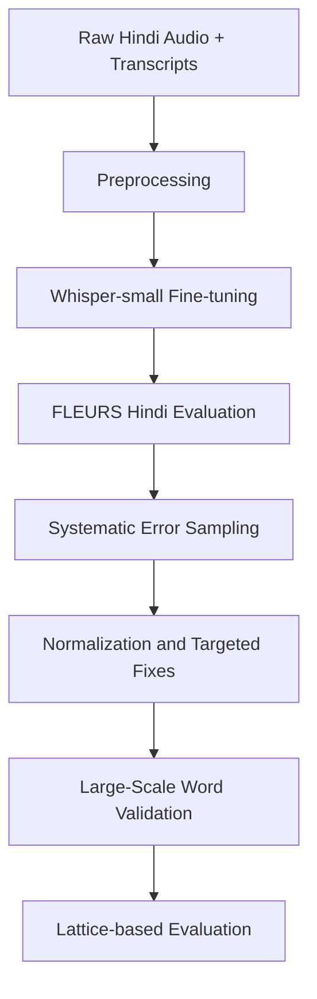

# Josh Talks Hindi ASR Project

> End-to-end assignment repository for Speech and Audio research using Whisper, Hindi conversational data, and error analysis.

## Quick Links

| Resource | Link |
|---|---|
| Fine-tuned model | [Whisper-small-fineTuned-Hindi](https://huggingface.co/Peeyush237/Whisper-small-fineTuned-Hindi) |
| Dataset | [Josh-talks-ASR-dataset](https://huggingface.co/datasets/Peeyush237/Josh-talks-ASR-dataset) |

## At A Glance

| Item | Value |
|---|---|
| Language | Hindi ASR |
| Base model | openai/whisper-small |
| Baseline WER | 86.99% |
| Fine-tuned WER | 46.74% |
| Relative gain | 46.27% improvement |
| Error sample size | 25 systematic errors |
| Post-normalization impact | 15.60% mean WER reduction |

## Project Flow

## What Each Notebook Does

| Notebook | Purpose |
|---|---|
| Josh_talks  question 1 final.ipynb | Full training/evaluation pipeline, WER benchmarking, 25-error sampling, normalization comparison |
| josh_talks_question_2.ipynb | Hindi number and text normalization, mixed-language handling experiments |
| josh_talks_quesiton_3_v2 (1).ipynb | Multi-stage spelling quality pipeline over a large word list |
| josh_talks_queston_4.ipynb | Lattice construction and lattice WER with insertion/deletion/substitution handling |

## Main Deliverables

| File | What it contains |
|---|---|
| systematic_25_errors.csv | 25 systematically sampled non-zero WER cases (Reference, Prediction, WER) |
| normalized_25_errors_results.csv | Before/after normalized comparison with New_WER |
| Question_3_Final_Deliverable.csv | 177,509-word spelling status output |
| Question_3_Final_Word_List_Expanded.csv | Expanded final word classification artifact |
| Josh_Talks_Whisper_Data/clean_whisper_data.csv | 2,522 rows mapping audio paths to Hindi transcripts |

## Assignment Coverage

| Question | Focus | Status |
|---|---|---|
| Q1 | Fine-tuning Whisper + WER analysis | Complete |
| Q2 | Post-processing and normalization logic | Complete |
| Q3 | Scalable spelling validation pipeline | Complete |
| Q4 | Lattice-based robust evaluation | Complete |

## Quick Start

1. Open Josh_talks  question 1 final.ipynb for the core pipeline and final metrics.
2. Review systematic_25_errors.csv and normalized_25_errors_results.csv for error-level changes.
3. Use josh_talks_question_2.ipynb for normalization strategies.
4. Use josh_talks_quesiton_3_v2 (1).ipynb for large-scale spelling analysis.
5. Use josh_talks_queston_4.ipynb with Question 4.xlsx for lattice evaluation.

## Notes

> This project was developed mainly in Google Colab.
> Some file paths use /content-style locations and may need local path updates before running.

